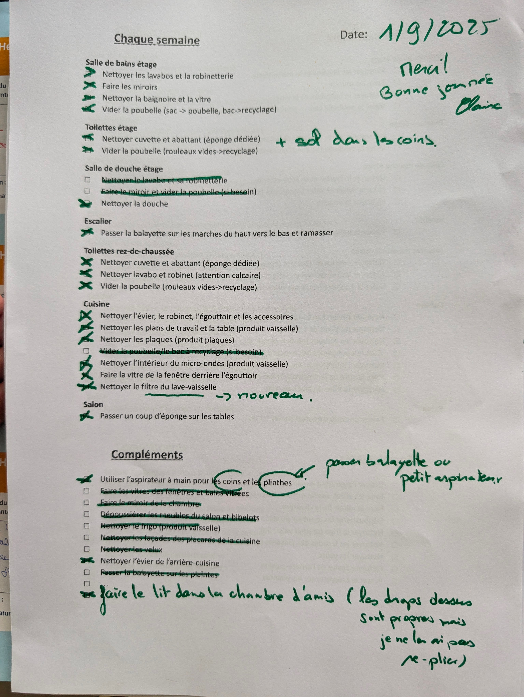

# Cleaning log digitilizer

## Description

Every week, we print a list of tasks for our cleaning lady and strike the one that we don't need her to do (like cleaning the guests bathroom if there hasn't been any guests), and we're also sometimes addeing comments or new tasks by hand. And then she checks what she has been able to do (most of the time everything because she's great) and sometimes add a comment like a list of household product to buy.

I wanted a way to keep track of what was cleaned and the different notes with the ulterior motive to maybe add remininders if we haven'T cleaned the windows for months for example.

So I build this scanner that let's met take a picture of our paper, then use Gemini to understand what's the tasks that were done or not, and send them to a google sheet.

## **[Try it on AI Studio](https://aistudio.google.com/apps/drive/1ZifLzSuOqzg3Ita9CC7kmRweauVanCy7?fullscreenApplet=true)**

## Initial Prompts (in French becaus eI wanted to try vibe coding in French)

"Toutes les semaines, nous écrivons sur une feuille les taches à faire par notre femme de ménage à partir d'un template sur lequel nous barrons ce qu'il n'y a pas à faire et ajoutons aprfois quelques choses à la main. Elle coche ensuite ce qu'elle a eu le temps de faire (parfois il y a trop de travail pour qu'elle fasse tout, et ce n'est pas un problème). Voici un exemple d'une telle feuille en photo. J'aimerais faire une application qui me permette de prendre une photo de ces feuilles après le passage de la femme de ménage et qui ensuite me remplisse in table google sheet avec les données fait/pas fait/pas demandé pour chaque semaine et chaque tâche, plus liste des demandes supplémentaires et ses retours s'il y en a (parfois elle marque qu'il manque des produits par exemple ou qu'elle n'a pas pu faire quelque chose). Le tableau doit avoir une colonne par semaine et une ligne par tâche, en prenant en compte qu'on ajoutera peut-être (sûrement) d'autres tâches au cours du temps."
---
"Premièrement je veux une app en Français, je veux que les commentaires, quand ils le sont (par exemple parce qu'il y a une flèche) soient liés à la tâche à laquelle ils correspondent. Par exemple "passer balayette ou petit aspirateur pour nettoyer les coins et le plinthes"."
---
"Il reste un problème, plusieurs tâches sont considérées non faites alors qu'elles étaient barrées (dans l'exemple "Nettoyer le lavabo et sa robinetterie",
"Faire le miroir et vider la poubelle", "Nettoyer le filtre du lave-vaisselle", "Dépoussiérer les meubles du salon et bibelots", "Nettoyer le frigo (produit vaisselle)", "Nettoyer les façades des placards de la cuisine", "Nettoyer les velux", "Nettoyer l'évier de l'arrière-cuisine", "Passer la balayette sur les plaintes").
Les tâches non faites sont uniquement celles qui ne sont pas barrées et pas cochées."
---
"Ajoute une option pour corriger les faux positifs en cliquant sur l'icone pour les faire passer de fait/non-fait/non demandé."
---
"Maintenant ajoutons la sauvegarde dans google sheet. RAppel des consignes:"Le tableau doit avoir une colonne par semaine et une ligne par tâche, en prenant en compte qu'on ajoutera peut-être (sûrement) d'autres tâches au cours du temps.". On va utiliser un appscript dans le google sheet et exposer un webhook pour pouvoir y envoyer du data sans avoir besoin de s'authentifier.
Je veux pouvoir soit les ajouter après avoir vu la première page d'analyse, ou alors avoir un bouton pour le faire directment sans checks au moment d'ajouter la photo."

## Time Spent

2 hours, but mainly because I was iterating on the script for the google sheet to make sure it would classify things the right way.

## AI Tools Used

*   [AI Studio](ai.studio/apps)
*   [Gemini](https://deepmind.google/models/gemini/)
*   Not really an AI tool, but [Apps script](https://developers.google.com/apps-script) to add a webhook to a google sheet to be able to send data to it from my AI Studio App.

## Challenges

The main one was how to manage false positives in an efficient way (when the model doesn'T see that a line is striked-through) and when it wuld make minor mistakes when  reading the lines (or also because we update them from time to time to add details). I ended up writting a list of common tasks per room so taht it always uses those names.

## Learnings

This is typically what vibe coding is great for: quickly spinning up an app to fullfill a very specific and personnal need that would not easily be covered by commercial apps. It's not fancy but it will save me some time every week.

## Run Locally

**Prerequisites:**  Node.js

1. Install dependencies:
   `npm install`
2. Set the `GEMINI_API_KEY` in [.env.local](.env.local) to your Gemini API key
3. Run the app:
   `npm run dev`

## Google Sheet integration

I had Gemini (directly in AI Studio) wtrite an [Apps script](https://developers.google.com/apps-script) for the Google sheet where I am storing my data that exposes a webhook that the App is using to send data to the sheet. The code and the explanations on how to use it is in the [appscript.js](./appscript.js) file. 

## To Do

For once I'm pretty happy with my app so I'm not really planning on adding any new features. Once that I missed was the ability to batch add multiple images to scan them at the same time, but now that I've been through all my stack I don't really need that feature. I will also need to test future Gemini models in the hope that they will be better at seeing what's striked-through.
